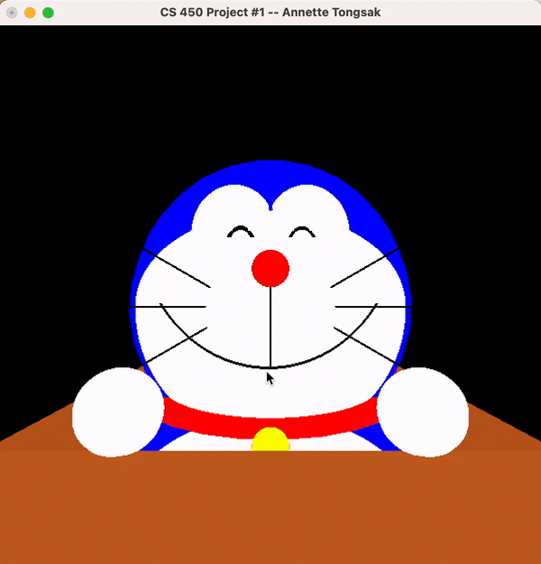
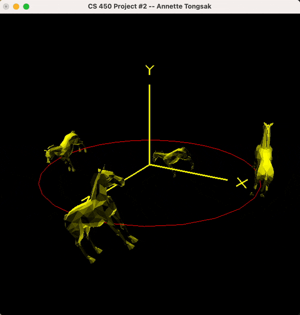
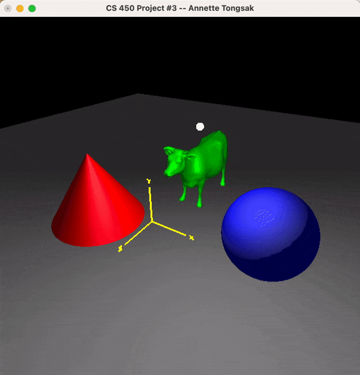
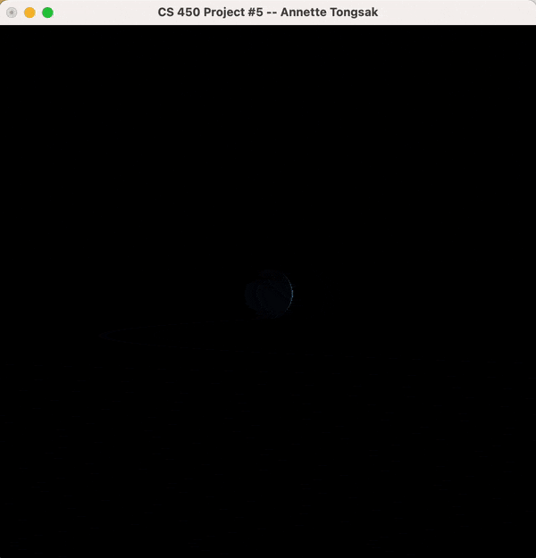
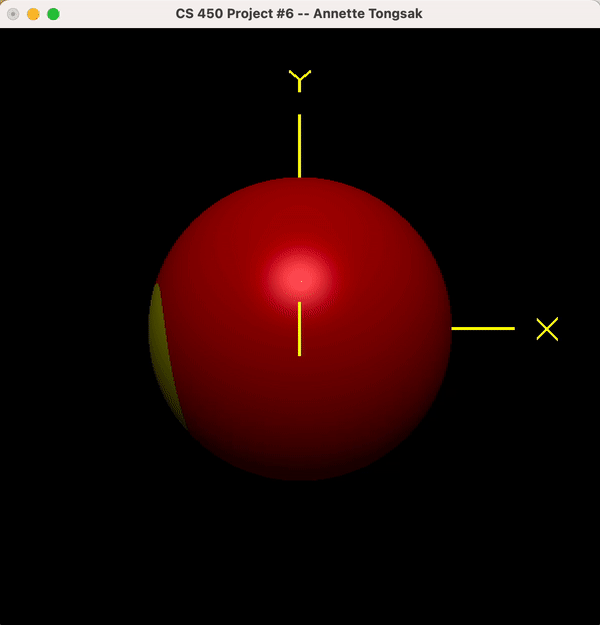
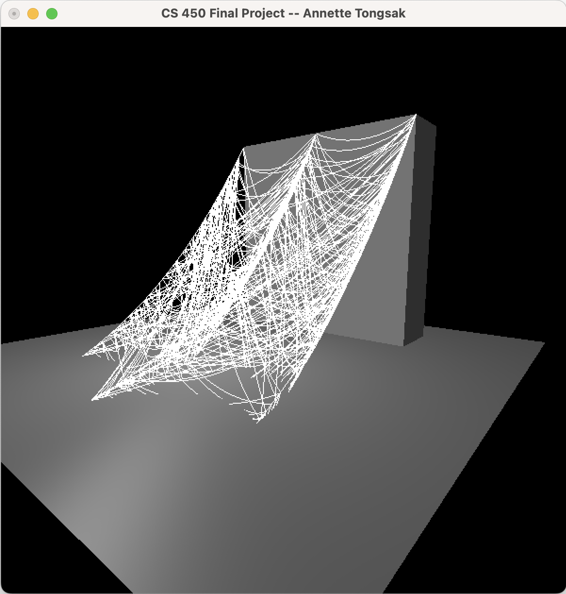
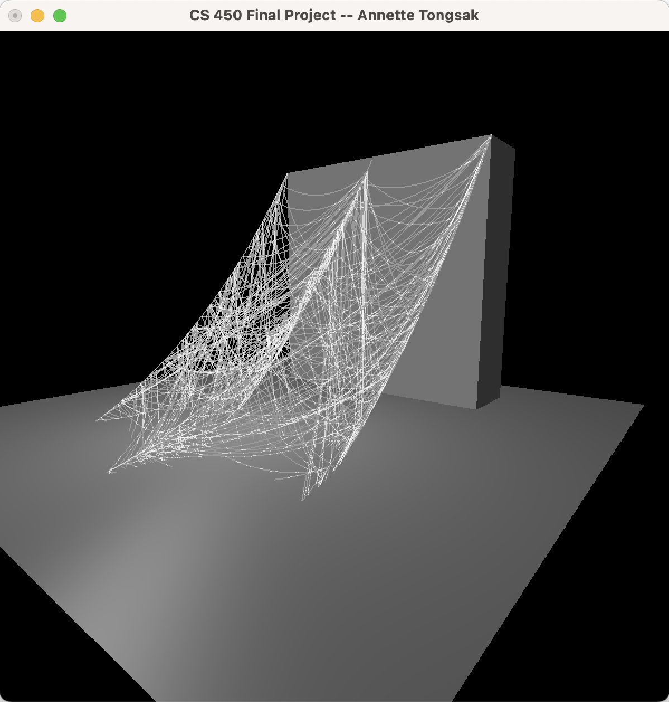

# CS 450 - Introduction to Computer Graphics

Here are all my projects from CS 450 - Introduction to Computer Graphics with Dr. Mike Bailey. I learned a lot about the graphics pipeline and how to implement iconic CG effects, from lighting to texture mapping to shaders, in C++ with OpenGL and GLSL. 

Check out my pdfs folder to read about my approach to each project!

## Draw Something Cool in 3D!

## Transformations

## Lighting

## Keytime Animation

## Texture Mapping

## Shaders

## Final Project - Random Cobweb Generator

